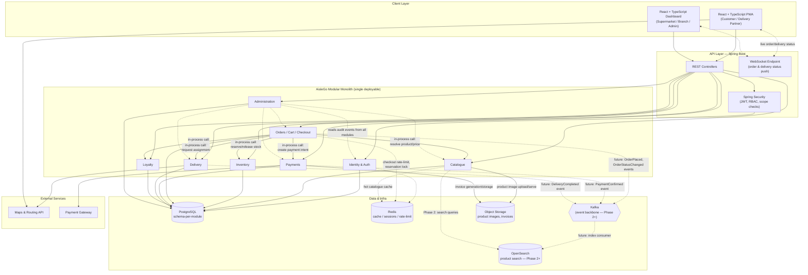

# AisleGo — System Architecture

**Related docs:** `01-PRD.md`, `05-database-er-diagram.md`, `08-security-and-fraud-control.md`, `11-deployment-architecture.md`

---

## 1. Architectural Approach: Modular Monolith

AisleGo starts as a **single deployable Spring Boot application** internally organized into strict, well-bounded modules — a modular monolith, not a ball of mud and not a premature microservices split. This is a deliberate choice for a Phase 0 product:

- **One team, one codebase, one deploy pipeline** is faster to build, test, and reason about than a distributed system, when order volume and team size don't yet demand distribution.
- **Module boundaries are enforced in code** (package-private internals, explicit public interfaces between modules, dependency rules checked in CI) so that splitting a module into its own service later is a mechanical extraction, not a rewrite.
- **A single Postgres database** (with clearly-owned schemas/tables per module) avoids the premature complexity of distributed transactions and eventual consistency for problems that don't need it yet — e.g. reserving inventory and creating an order can happen in one ACID transaction today.
- **In-process calls are the default communication mechanism** between modules right now (a direct Java method/interface call, not HTTP or a queue). Kafka is provisioned from day one architecturally (topics/event contracts are designed early) but is not load-bearing for Phase 0's happy path — it is introduced as modules need to react to each other asynchronously (notifications, analytics, search indexing) rather than as the backbone for core order flow.

## 2. Module Boundaries

| Module | Owns | Does not own |
|---|---|---|
| **Identity & Auth** | Users (all roles), authentication, sessions, role/scope claims | Business data of any other module |
| **Catalogue** | Supermarkets, branches, products, categories, offers/coupons/bundles | Live stock counts (owned by Inventory), orders |
| **Inventory** | Per-branch stock levels, reservations, stock adjustments | Product metadata (owned by Catalogue) |
| **Orders** | Cart, checkout, order lifecycle/state machine, order items | Payment capture (delegates to Payments), stock (delegates to Inventory) |
| **Payments** | Payment intents, gateway integration, refunds, settlement ledger | Order business logic |
| **Delivery** | Delivery-partner accounts, assignment matching, pickup/delivery OTP, live location | Order contents |
| **Loyalty** | Points accrual/redemption rules, loyalty ledger | Order pricing (reads it, doesn't own it) |
| **Administration** | Verification workflows, disputes, platform config, audit log aggregation, platform analytics | Day-to-day store operations |

### 2.1 Module Diagram

## 3. Communication Patterns

| Interaction | Mechanism today (Phase 0) | Mechanism later |
|---|---|---|
| Orders module needs current price/product info | Direct in-process interface call to Catalogue module | Unchanged (Catalogue likely stays in-monolith longest) |
| Orders module reserves stock at checkout | Direct in-process call to Inventory, inside the same DB transaction | If Inventory is extracted: synchronous API call + saga-style compensation |
| Orders module creates a payment intent | Direct in-process call to Payments, which calls out to the external gateway | Unchanged in shape; Payments is a likely early extraction target (see §5) |
| Order status changes need to reach the customer/store in real time | WebSocket push directly from the Orders module through the API layer | Same, or fed by a Kafka consumer once events exist |
| Notify Loyalty to accrue points after delivery | Direct in-process call today | Kafka event (`OrderDelivered`) consumed by Loyalty, decoupling it from the order completion transaction |
| Feed Administration's audit log | Direct in-process append (all modules write to a shared `audit_log` table via a common audit service) | Kafka event stream (`*.audit` topics) aggregated into a dedicated audit/log store |
| Product search | Direct Postgres query (`ILIKE`/trigram/basic filtering) in Phase 0 | OpenSearch-backed full text + filter search once catalogue size/query complexity justifies it (Phase 2) |

## 4. Where Supporting Infrastructure Plugs In

- **Redis** — three concurrent uses from day one: (1) Spring Session/JWT-adjacent session and refresh-token blacklist storage, (2) API rate-limiting counters (per-user and per-IP, especially on checkout and OTP endpoints), (3) short-TTL caching of hot read paths (store discovery results by geo-cell, catalogue category listings). Also used to hold short-lived inventory reservation locks during the checkout window (see `08-security-and-fraud-control.md` §4).
- **Kafka** — provisioned as infrastructure early (topic naming conventions and event schemas designed alongside the domain model) but not required for Phase 0's synchronous happy path. It becomes the event backbone starting Phase 2 for: order lifecycle events feeding notifications/analytics, OpenSearch indexing, and inter-module decoupling as modules are extracted. See `09-roadmap.md`.
- **OpenSearch** — introduced in Phase 2 to power fast, relevant, typo-tolerant product and store search at scale, replacing Postgres `ILIKE`/trigram search once catalogue size and query volume justify a dedicated search engine. Fed by a Kafka consumer indexing catalogue change events.
- **Object storage** (S3-compatible) — stores product images (uploaded by supermarkets), generated PDF invoices, and verification documents (business registration, delivery-partner ID) submitted during onboarding. Never stores payment data.
- **Maps & routing API** — powers store-discovery distance/ETA and manual-address geocoding via a pluggable `RoutingService` (mirroring the Payment gateway seam below it): `HaversineRoutingService` is the unconditional default, zero-setup provider (great-circle distance, ETA approximated from an assumed average driving speed); `OpenRouteServiceRoutingService` (OpenRouteService, OpenStreetMap-based) is an opt-in alternative giving real driving distance/ETA in discovery and working address geocoding, falling back to the same Haversine calculation on any API failure (network error, rate limit, outage). Delivery-partner turn-by-turn navigation and live location tracking display during the delivery leg are **not yet built** — they depend on the Delivery module's live-tracking functionality, which doesn't exist as a feature yet (see `09-roadmap.md`).
- **Payment gateway** — the only component that ever touches raw card/payment credentials. AisleGo's Payments module only ever holds gateway-issued tokens and references (see `08-security-and-fraud-control.md` §2).

## 5. Extraction Path to Microservices

The modular monolith is a starting point, not a permanent architecture — but extraction is triggered by evidence, not by calendar time or fashion.

**Triggers that justify extracting a module into its own service:**

1. **Independent scaling need** — a module's load profile diverges sharply from the rest of the system (e.g. delivery location updates arrive far more frequently than order writes) such that scaling the whole monolith to serve one module's load becomes wasteful.
2. **Independent deployment cadence** — a module needs to ship changes far more frequently (or with far more caution) than the rest of the system, and monolith-wide redeploys are becoming a bottleneck for that team.
3. **Fault isolation need** — a module's failure modes (e.g. a flaky external dependency) should not be able to bring down unrelated functionality (e.g. a payment gateway outage should never prevent customers from browsing catalogues).
4. **Team topology** — a dedicated team forms around a module and needs true ownership of its deploy lifecycle and on-call boundary.
5. **Data model divergence** — a module's data access patterns and consistency requirements diverge enough from the shared Postgres instance that a dedicated store (different DB technology, different scaling shape) is warranted.

**Most likely first candidates, and why:**

- **Delivery** — highest-frequency write path in the system once live (constant location pings during active deliveries), lowest coupling to the transactional core (it doesn't need to participate in the order's ACID transaction, only to be notified and to notify back), and a natural fit for a different scaling/latency profile (near-real-time geospatial workload vs. transactional order/catalogue workload).
- **Payments** — strongest isolation argument: PCI-adjacent handling benefits from a narrower security perimeter, it already talks to an external gateway asynchronously, and isolating it limits the blast radius of any payment-related incident or compliance audit to one well-bounded service.
- **Catalogue/Search**, once OpenSearch is fully load-bearing (Phase 2+), is a plausible next candidate since search read traffic will vastly outstrip everything else and scales independently of writes.

Modules **not** expected to be extracted soon: Identity & Auth (needed synchronously by everything — extracting it early just adds a network hop with little isolation benefit until true multi-service auth federation is needed), Administration (low volume, cross-cutting, benefits from staying close to the data it audits).

**Extraction discipline:** because module boundaries (Java package structure, public interfaces, and per-module schema ownership in Postgres) are enforced from day one, an extraction is expected to follow this pattern: (1) module's public interface becomes a REST/gRPC contract instead of a Java interface, (2) module's owned tables move to their own database/schema, (3) any transaction that used to be ACID across modules is redesigned as a saga with compensating actions, (4) the old in-process call sites are swapped for a client/adapter implementing the same interface. No extraction is planned before Phase 3, and it will always be scoped to one module at a time.
