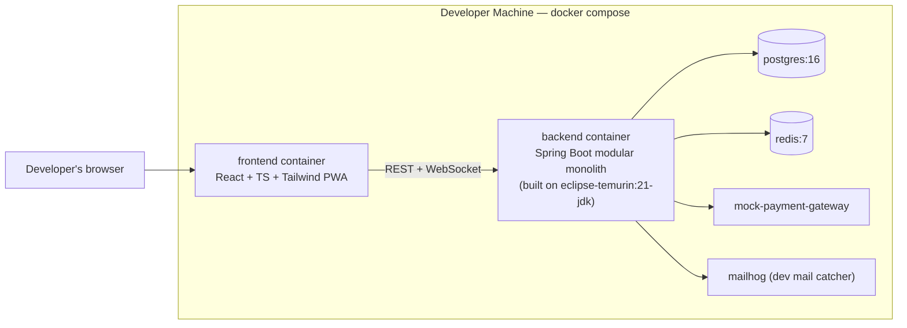
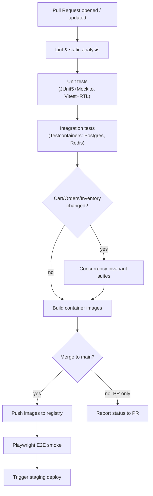
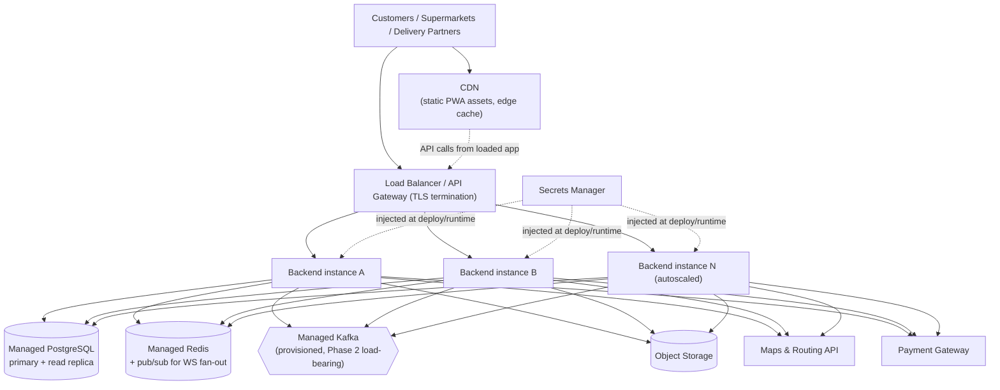

# AisleGo — Deployment Architecture

**Related docs:** `04-architecture.md`, `10-testing-strategy.md`

---

## 1. Local Development — Docker Compose

Local development runs the full stack via Docker Compose so every contributor works against a consistent, production-like environment without manually installing PostgreSQL, Redis, or a JDK 21 locally.

**Services in the local Compose stack:**

| Service | Image / build | Purpose |
|---|---|---|
| `backend` | Built from `eclipse-temurin:21-jdk` (multi-stage build via the Gradle Wrapper) | The Spring Boot modular monolith |
| `frontend` | Node 20 build, served via a lightweight static/dev server | React + TypeScript + Tailwind PWA (customer, supermarket, delivery, admin surfaces) |
| `postgres` | `postgres:16` | Primary relational datastore |
| `redis` | `redis:7` | Cache, session/refresh-token store, rate-limit counters |
| `mock-payment-gateway` | Lightweight internal stub service | Simulates authorize/capture/refund/webhook behavior for Phase 0 (see `09-roadmap.md`) |
| `mailhog` / equivalent | Dev-only mail catcher | Captures outbound emails (verification, notifications) for local inspection instead of sending real mail |

Notes specific to this environment: the local host may not have a JDK 21 or a `gradle` binary installed, so the backend is always built and run **inside Docker** using the Gradle Wrapper (`./gradlew`) against the `eclipse-temurin:21-jdk` base image — contributors are not expected to run the backend natively outside Docker. The frontend, by contrast, can run natively with local Node 20/npm tooling for fast iteration, with Compose used mainly to run its production-style container build for integration testing.

Bring-up is a single `docker compose up`; a seed script populates sample supermarkets, branches, products, and test accounts for each role so the full journey set in `03-user-journeys.md` can be exercised locally without manual setup.

## 2. Continuous Integration — GitHub Actions

CI runs on every pull request and on merge to `main`, structured as staged jobs so fast checks fail quickly before slower ones run:

1. **Lint & static analysis** — backend (Checkstyle/Spotless or equivalent Java linting) and frontend (ESLint, TypeScript type-check) run in parallel; fails fast on style/type violations.
2. **Unit tests** — JUnit 5 + Mockito (backend) and Vitest + React Testing Library (frontend) run in parallel jobs.
3. **Integration tests** — Testcontainers-backed module tests spin up real ephemeral Postgres/Redis instances inside the CI runner (see `10-testing-strategy.md` §3).
4. **Container image build** — backend image built from `eclipse-temurin:21-jdk` via the Gradle Wrapper, frontend image built via the Node build step; both tagged with the commit SHA and pushed to the container registry on merge to `main` (build-only, not pushed, on pull requests).
5. **Concurrency invariant suites** — the single-supermarket-cart and stock-reservation concurrency test suites (`10-testing-strategy.md` §7) run as a dedicated job whenever Cart/Orders/Inventory module code changes.
6. **E2E smoke (main only)** — Playwright golden-path suite runs against the freshly built containers on merge to `main`, ahead of deployment to staging.

Failing any stage blocks merge; the container-image and E2E stages are skipped on draft PRs to keep iteration fast, and run in full on marking a PR ready for review.

## 3. Target Cloud Deployment Topology

Phase 0 targets a single-region cloud deployment; the topology is designed so later multi-region scaling (`09-roadmap.md` Phase 3) is additive rather than a redesign.

**Core components:**

- **Managed PostgreSQL** (e.g. a cloud provider's managed Postgres service) with automated backups, point-in-time recovery, and a read replica reserved for reporting/analytics queries so heavy admin/analytics reads never contend with the transactional hot path (checkout, order updates).
- **Managed Redis** for the same roles as local dev (sessions, rate-limiting, reservation-adjacent locks), provisioned with persistence enabled for session continuity across restarts.
- **Managed Kafka** (provisioned ahead of Phase 2's event-backbone rollout — see `04-architecture.md` §1) so the operational groundwork (topic ACLs, networking, monitoring) exists before it becomes load-bearing.
- **Object storage** (S3-compatible) for product images, invoices, and verification documents, with tenant-prefixed paths and short-lived signed URLs (see `08-security-and-fraud-control.md` §8).
- **CDN in front of the frontend PWA** — static assets and the PWA app shell are served from a CDN edge network with long-lived cache headers on immutable, content-hashed build artifacts, and the service worker manages runtime caching/offline behavior on top of that.
- **Backend runs as a horizontally-scaled container service** (e.g. a managed container orchestrator/App-Runner-style service) behind a load balancer, with the WebSocket endpoint routed with sticky-enough affinity (or backed by Redis-based pub/sub for cross-instance status fan-out) so real-time order updates reach the right connected client regardless of which backend instance handled the originating status change.
- **Maps/routing API and payment gateway** are external managed services reached over TLS from the backend (and directly from the frontend where the gateway's hosted-fields/tokenization SDK requires direct browser-to-gateway communication).

**Deploy strategy:** rolling deployment for the backend service (new instances brought up and health-checked before old instances are drained), with blue-green promotion reserved for changes touching the database schema or other higher-risk migrations, so a bad release can be rolled back by re-pointing traffic rather than by reversing in-flight instance replacement. Database migrations are applied as a distinct, backward-compatible-first step ahead of code rollout (expand/contract migration pattern) so rolling backend instances never run against a schema shape they don't understand.

**Secrets management:** database credentials, Redis credentials, payment-gateway API keys, maps-API keys, and JWT signing keys are held in a dedicated secrets manager (not in environment files committed to the repository or baked into container images) and injected into the runtime environment at deploy time; secrets are scoped per-environment (dev/staging/prod each have distinct credentials) and rotated on a defined schedule as well as immediately on suspected compromise.

**Environment promotion:** changes flow **dev → staging → production**. Dev is the shared integration environment fed by every merge to `main` (per the CI pipeline in §2). Staging is a production-topology mirror (same managed-service types, smaller scale) used for release candidate validation, including a manual smoke pass through the golden-path journeys before promotion. Production promotion requires a passing staging validation and is gated by an explicit release step (not automatic on every staging deploy), keeping a human decision point before customer-facing supermarkets and delivery partners are affected.
